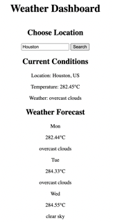

# **Weather-Dashboard**

## **Description**
This project allowed me to use my knowledge of HTML, CSS and JavaScript server-side APIs to create a weather forcast application that allows users to search for a five day forecast in any specified location. 

- - - -
## **Table of Contents**
- [Usage](#usage)
- [Website Preview](#website-preview)
- [Credits](#credits)
- [License](#license)
- [How to Contribute](#how-to-contribute)
- - - -
## **Usage**
To access and use my project, click the "Weather Dashboard" link shown in the [Website Preview](#website-preview) section below. 
Enter any city name in the "choose location" box to display the five day forecast for that area. When you click search, you will see the weather forecast for the current and next four days.  
- - - -
## **Website Preview**
[Weather Dashboard](https://alexisstrong11.github.io/Work-Scheduler/)

- - - - 
## **Credits**
NOTE: *I received help from the instructors and tutors to assist with my project.*

- - - - 
## **License**
MIT License

Copyright (c) 2023 Alexis Strong

Permission is hereby granted, free of charge, to any person obtaining a copy
of this software and associated documentation files (the "Software"), to deal
in the Software without restriction, including without limitation the rights
to use, copy, modify, merge, publish, distribute, sublicense, and/or sell
copies of the Software, and to permit persons to whom the Software is
furnished to do so, subject to the following conditions:

The above copyright notice and this permission notice shall be included in all
copies or substantial portions of the Software.

THE SOFTWARE IS PROVIDED "AS IS", WITHOUT WARRANTY OF ANY KIND, EXPRESS OR
IMPLIED, INCLUDING BUT NOT LIMITED TO THE WARRANTIES OF MERCHANTABILITY,
FITNESS FOR A PARTICULAR PURPOSE AND NONINFRINGEMENT. IN NO EVENT SHALL THE
AUTHORS OR COPYRIGHT HOLDERS BE LIABLE FOR ANY CLAIM, DAMAGES OR OTHER
LIABILITY, WHETHER IN AN ACTION OF CONTRACT, TORT OR OTHERWISE, ARISING FROM,
OUT OF OR IN CONNECTION WITH THE SOFTWARE OR THE USE OR OTHER DEALINGS IN THE
SOFTWARE.
- - - - 
## **How to Contribute**
[Contributor Covenant](https://www.contributor-covenant.org/)
